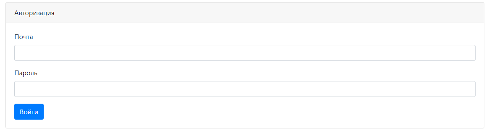
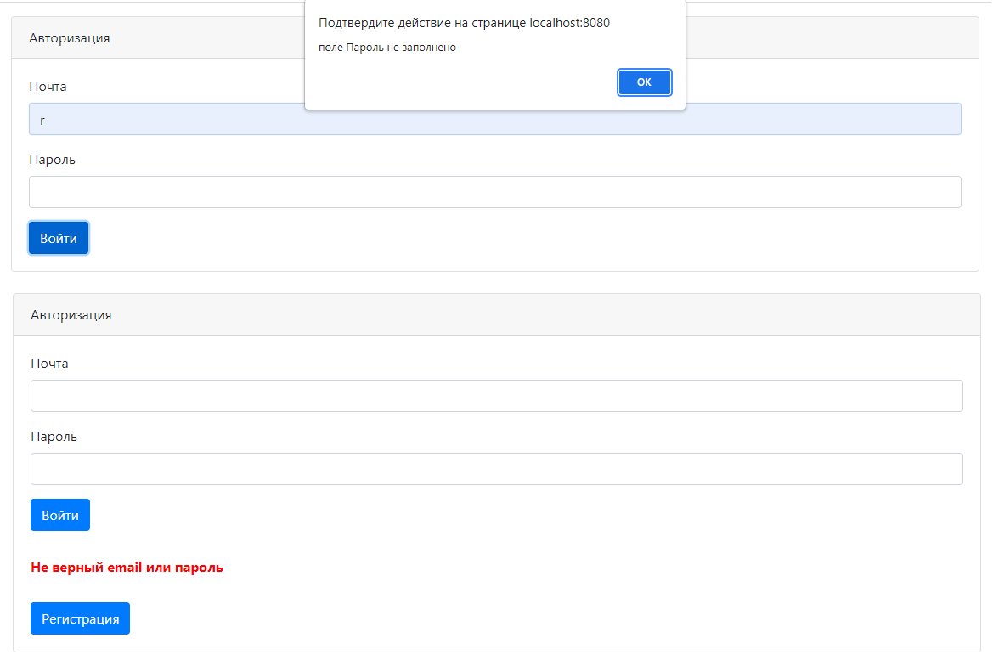
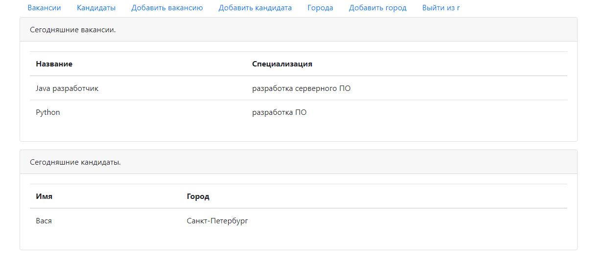
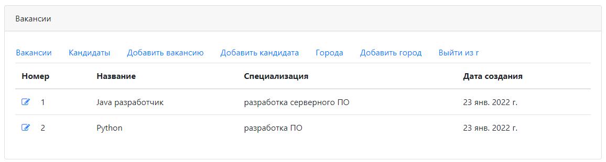
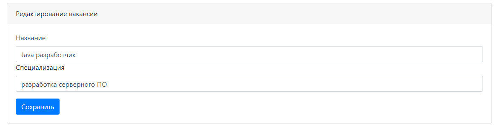
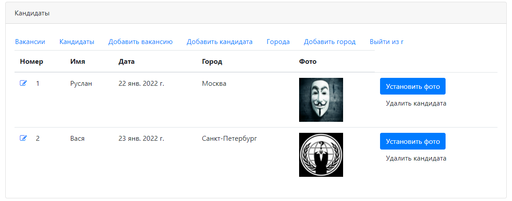
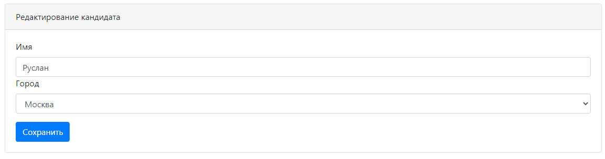
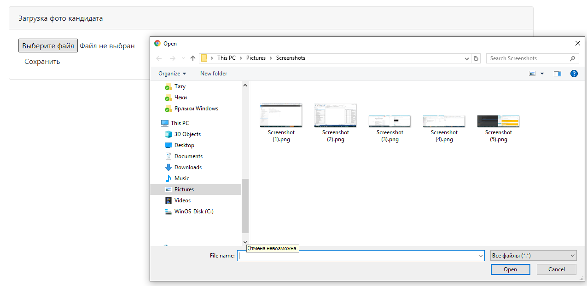

# job4j_dreamjob
Техническое задание - проект "Работа мечты"

Для работы с сайтом, необходима авторизация.

Также контролируется заполненость полей и корректность данных авторизации.

На главной страницы, после авторизации выводиться свежие вакансии и кандидаты.
Размещенные сегодня.

С главной страницы можно перейти на страницу списка вакансий.

Редактировать или добавить вакансию.

Или на страницу со списком кандидатов.

Редактировать или добавить кандидата.

Установить фото кандидата.

Также можно удалить кандидата.
Хранение данных о пользователях, вакансиях, кандидатах и городах реализовано в БД Postgres SQL.